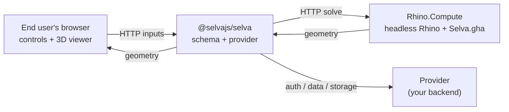

# Architecture

How the parts fit together.

## Four moving parts

| Part                                 | What it is                                     | Runs on                                |
| ------------------------------------ | ---------------------------------------------- | -------------------------------------- |
| **Selva plugin** (`Selva.gha`)       | The schema _designer_ + bridge to a live Rhino | Author's Rhino, and the Compute server |
| **Selva web app** (`@selvajs/selva`) | The schema _runner_                            | Your server                            |
| **Rhino.Compute**                    | Headless Rhino that solves over HTTP           | A Windows VM                           |
| **Provider**                         | Pluggable auth / data / storage backend        | In-process with the web app            |

Everything else (`@selvajs/ui`, `schemas`, `compute`, `visualization`, `solve`, `server`, `platform`) is a shared library these four are built from.

## The schema is the contract

A **schema** describes a definition's web interface: which inputs are exposed, what control each one maps to, the layout, and the outputs. You create it in the designer, and the web app reads it to render the UI.

Its shape is defined once in `ui-schema.json` and code-generated into **both** stacks: TypeScript for the web app, C# for the plugin. CI fails on drift. That's what keeps a C# plugin and a TS web app speaking the same language without a hand-written API spec.

## Two runtime paths

**Design time: WebSocket to a live Rhino.** While you build the interface, the plugin runs a WebSocket server inside your Rhino, on loopback (port 8765 by default, or a free one if that is taken). The designer connects to it, discovers parameters, and writes the schema back into the `.gh`. Changes round-trip live.

**Run time: HTTP to Rhino.Compute.** Once deployed there's no live Rhino. The web app loads the saved schema and sends inputs to Rhino.Compute over HTTP on each change. Compute solves headlessly and returns geometry to the Three.js viewer.

## The packages

| Package                  | Role                                                                                                                                          |
| ------------------------ | --------------------------------------------------------------------------------------------------------------------------------------------- |
| `@selvajs/schemas`       | The schema contract + TS/C# generators. Source of truth for both stacks.                                                                      |
| `@selvajs/plugin-ui`     | The schema designer UI. Embedded into `Selva.gha`.                                                                                            |
| `@selvajs/selva`         | The deployable web app.                                                                                                                       |
| `@selvajs/ui`            | Shared Svelte components, theme, viewer building blocks.                                                                                      |
| `@selvajs/compute`       | Type-safe Rhino.Compute client and data trees. Pure solve/data, no renderer. See [Build your own app](getting-started/build-your-own-app.md). |
| `@selvajs/visualization` | Headless viewer core: solve response → Three.js. Layers `scene` → `render` → `parse`.                                                         |
| `@selvajs/solve`         | The solve flow, both sides of the wire (`client` / `server`).                                                                                 |
| `@selvajs/server`        | Server building blocks: limits, rate limit, SSRF guard, definitions.                                                                          |
| `@selvajs/platform`      | Provider _interfaces_, no implementations. See [Providers](providers.md).                                                                     |
| `@selvajs/*-provider`    | Concrete provider implementations.                                                                                                            |
| `@selvajs/cli`           | Scaffolds and operates a deployment. See [CLI](CLI.md).                                                                                       |

On the .NET side, schema and drawing logic sit apart from the Rhino-coupled `Selva.GH`/`Selva.Rhino`. That half has no Rhino dependency, so it's unit-testable.

## What stays in sync

- **Plugin ↔ web app.** Both generate from `ui-schema.json`, and CI fails on drift.
- **Providers ↔ interfaces.** Every adapter runs a conformance suite, so a new provider behaves like the reference one.

## Next

- [Providers](providers.md): the backend model.
- [Get Started](getting-started/overview.md): stand it up.
- [Build your own app](getting-started/build-your-own-app.md): use the packages directly.
