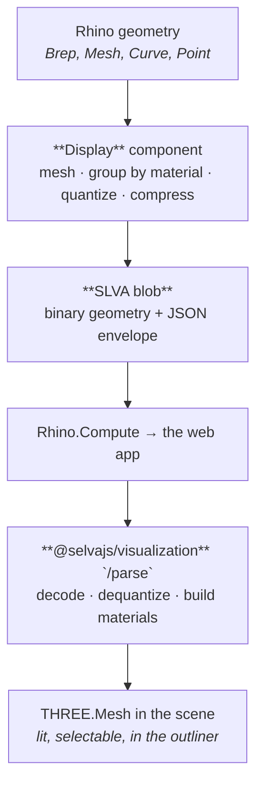

# The display pipeline and the SLVA format

What happens between a Brep on the Grasshopper canvas and a lit, selectable mesh in the browser.

The C# Display component encodes; `batch-parser.ts` and `binary-parser.ts` decode. Both ends have to agree — see the normative-spec note in stage 2 before changing either.

## The short version



Five stages. The first two happen in Grasshopper, the last two in the browser.

## Stage 1: Meshing (Grasshopper)

The **Display** component takes geometry as a tree and converts anything that isn't already a mesh into one, using the meshing settings on its `MS` input (default: `FastRenderMesh`).

Alongside the geometry it reads four parallel trees:

| Input          | Purpose                                                                |
| -------------- | ---------------------------------------------------------------------- |
| `Name` (N)     | The object's name in the scene outliner.                               |
| `Layer` (L)    | Grouping path, e.g. `Structure/Walls`. Builds the outliner tree.       |
| `Metadata` (D) | `Key=Value` strings surfaced when the user selects the object.         |
| `Material` (M) | A **Three Material**. Objects sharing a material get batched together. |

**One batch per input branch.** The output tree mirrors the input tree rather than flattening, so branch structure you built upstream survives into the viewer.

Two things worth knowing here:

- **Meshing is the expensive part.** It runs on a background task, not the solver thread, so Grasshopper stays responsive. But on a slow definition it still dominates. If your geometry doesn't change between solves, mesh once and cache it with **Display To File** / **Display From File**.
- **Non-mesh geometry rides along as JSON.** Curves and points are not meshed; they travel as _display items_ alongside the binary blob. Curves are tessellated to a polyline here, on the plugin side, which is why the browser needs no `rhino3dm`.

## Stage 2: Encoding (Grasshopper)

The meshes are packed into a compact binary format:

1. **Group by material.** Every unique material becomes one group; all meshes using it are concatenated into one vertex/index stream. Fewer groups means fewer draw calls in the browser.
2. **Quantize.** Vertex positions snap to a signed 16-bit grid spanning the geometry's bounding box: half the size of float32, with error far below anything visible. If the resulting step would exceed 5 cm per int16 unit (a very large model), the block falls back to raw float32 rather than degrade the preview. UVs quantize to unsigned 16 bits the same way, with their own fallback past 1/4096 (heavily tiled UVs). Vertex colours are 8-bit per channel and never fall back.
3. **Delta filter.** Each vertex component is stored as the difference from the previous vertex, zigzag-mapped so small differences become small unsigned numbers. Welded meshes have spatially-local vertices, so the deltas cluster near zero. This is a PNG-style pre-filter: it exists purely to make the last step work better. A side effect worth knowing: it makes a part's vertex stream translation-invariant, so repeated parts (the same screw placed 500 times) become repeated byte runs that DEFLATE dedupes — instancing-like savings with no instancing in the format.
4. **Byte layout, chosen per blob.** The filtered streams are written either interleaved (x,y,z per vertex) or planar byte-split (all X deltas, then Y, then Z, low bytes before high). Neither wins everywhere, so the writer deflates both and keeps the smaller, recording the choice in a flag bit:
   Which one wins turns on the vertex count of the individual repeated part, not on how many copies the batch holds:
   - **Planar** wins on welded surfaces and on scatters of substantial parts, where near-zero deltas turn the high planes into runs of zeros. This needs each plane's run to be long enough to matter, which holds once a part carries more than roughly 64 vertices — from there the margin grows fast (measured 21% at 64 vertices per part, 75% at 1024).
   - **Interleaved** wins on batches of very small repeated parts. Below roughly 16 vertices per part a copy's delta stream is only tens of bytes, too short to form useful LZ77 matches once planar scatters it across six distant planes. Measured 6–13% on thousands of boxes — the shape an assembly of bolts, posts or panel clips takes.

   Between roughly 16 and 64 vertices per part the two sit within a percent or two of each other. Nothing cheap infers part size from a flat vertex array — a batch arrives as one concatenated buffer with no part boundaries — hence the measurement. Colors stay interleaved unconditionally: planar loses on noisy per-channel data. Batches under 4096 vertices skip the probe and take planar; the wire difference there is a few hundred bytes, less than the two trial deflates cost.

5. **Deflate.** The chosen stream is compressed, and the whole blob wrapped in an `SLVZ` container when that actually shrinks it. Decoders sniff `SLVA` vs `SLVZ` from the leading magic, so the result is self-describing.

Curves and points ride as JSON next to the blob.

Version gates are additive: each bump so far only added a flag bit, and readers ignore trailing bytes, so a decoder handles every blob back to version 1. That matters because blobs persist: saved `.gh` files, `.slvm` mesh files and cached compute results must stay decodable after an upgrade. The frozen pre-v4 fixtures under `packages/schemas/fixtures/slva/v3/` pin this on both stacks — never regenerate them.

> **The byte-level spec is normative and lives in code, in two places that must agree:** the remarks block at the top of [`BinaryGeometryWriter.cs`](../../Plugin/Selva.GH/Features/Display/Services/BinaryGeometryWriter.cs) (encoder) and the constants in [`binary/header.ts`](../../packages/visualization/src/parse/webdisplay/binary/header.ts) (decoder). Change them together and bump the version.
>
> The format is internal to the plugin and `@selvajs/visualization`. It is versioned and can change without a major bump; don't build against it directly.

## Stage 3: Transport

The blob travels inside a `DisplayBatch` JSON envelope (`types.ts`): base64 over HTTP from Rhino.Compute, raw binary over the plugin's WebSocket. Large file outputs stream out-of-band instead ([ADR 0003](../adr/0003-large-file-output-streaming.md)); display payloads currently do not.

Producing these payloads requires the VektorNode Rhino.Compute fork.

This is the stage to look at when a scene is slow to _appear_ but fast to _interact with_. Check the payload size with the **Display Size** component. If it's large, the usual causes are meshing too finely, or emitting geometry the user can't see.

## Stage 4: Parsing (browser)

Handled by `@selvajs/visualization` in its `/parse` layer. It reverses the encode:

```
solve response
  └─ webdisplay-parser      pick out display data, scale to metres, ground, bound
       └─ batch-parser      entry points; dispatches the off-thread worker path
            ├─ binary-parser     SLVA decode: header, inflate, un-delta, dequantize
            ├─ batch/metadata    validate group windows, dequantize
            ├─ batch/materials   SerializableMaterial → MeshPhysicalMaterial
            ├─ batch/merge       build merged + individual meshes
            └─ mesh-assembly     the pure assembly function the worker and main thread share
```

Curves and points go down a separate path. Nothing is decoded in the browser: the plugin tessellates curves and sends `points`, which become fat `Line2` lines and `THREE.Points` clouds. This package has no `rhino3dm` dependency.

Two behaviours to know:

- **Parsing can run in a worker.** Decoding a large blob on the main thread would block the UI, so the batch parser has an off-thread path.
- **Absent data is not an error, corrupt data is.** An envelope with no display data yields an empty scene. A _truncated_ blob or an out-of-range group window throws: better a visible failure than a silently half-rendered model.

## Stage 5: The scene

The parsed meshes are added to the Three.js scene by the viewer (`/render`), and the scene outliner (`/scene`) reads visibility, selection, and the layer tree off them. The `Layer` strings from stage 1 are what build that tree; the `Metadata` pairs are what the selection panel shows.

Three invariants hold across the whole pipeline:

- **One coordinate frame end to end.** The Three scene _is_ Rhino's Z-up frame. Vertices pass through unrotated; nothing anywhere reintroduces a rotation.
- **Nothing caches across solves.** Every solve decodes its own geometry and textures. The scene owns what it built and frees it when replaced.
- **The scene owns its GPU resources.** Geometries and textures are disposed with the objects holding them.

## Debugging a bad scene

| Symptom                                    | Look at                                                                                   |
| ------------------------------------------ | ----------------------------------------------------------------------------------------- |
| Nothing renders                            | Is the Display output actually reaching the schema? Check the UI Bridge picked it up.     |
| Geometry is there but untextured/grey      | Material wired? A texture that failed to load leaves the base colour.                     |
| Faceted where it should be smooth          | Meshing settings on Display's `MS` input.                                                 |
| Slow to load                               | **Display Size**. Then meshing density, then how much geometry you're emitting at all.    |
| Slow to orbit once loaded                  | Too many distinct materials: every unique material is its own draw call. Share materials. |
| Scene looks right, outliner is a flat list | The `Layer` input is empty. It's what builds the tree.                                    |
| Curves missing, meshes fine                | Curves arrive pre-tessellated from the plugin. An older plugin build won't send them.     |

## Next

- [Parse layer](../../packages/visualization/src/parse/README.md): the barrel this format is decoded behind.
- [Caching](../self-hosting/concepts/caching.md): what is and isn't reused between solves.
