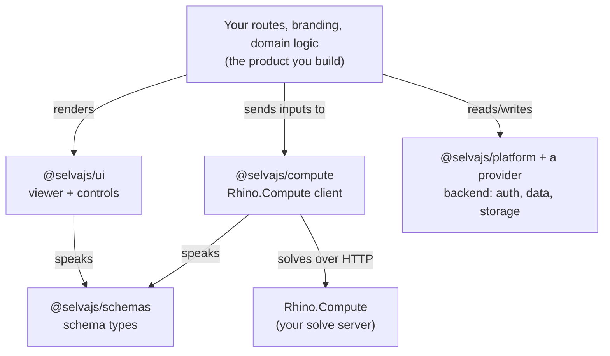

# Build your own app

The standalone `@selvajs/selva` app covers most teams. But Selva's capabilities also ship as npm packages, so if you're building your own product, you can embed Selva's viewer, controls, and compute pipeline inside it.

This is the path for teams who need their own branding, domain model, and routes, with the Selva engine doing the parametric work underneath.

## The model

Build a normal SvelteKit app, add the `@selvajs/*` packages, wrap them in whatever product you're building.



Read it top-down: **your app** is the product; it pulls in the viewer (`ui`), the compute client, and a backend (`platform` + provider) as building blocks. `ui` and `compute` both speak the same schema contract (`schemas`), and `compute` is the only piece that talks to your Rhino.Compute server. Take only the boxes you need.

## Building blocks

| Package                          | Gives you                                                                                                    |
| -------------------------------- | ------------------------------------------------------------------------------------------------------------ |
| `@selvajs/ui`                    | Svelte components, theme, and the 3D viewer: the same UI primitives the Selva app uses. Style to your brand. |
| `@selvajs/compute`               | Type-safe Rhino.Compute client. Turns inputs into solved geometry — no renderer. See below.                  |
| `@selvajs/schemas`               | Schema types + traversal helpers, so your app speaks the plugin's interface contract.                        |
| `@selvajs/platform` + a provider | The backend contract + an implementation. See [Providers](../providers.md).                                  |

Take only what you need. For example, just `@selvajs/ui` + `@selvajs/compute` for the viewer and compute in an otherwise-bespoke app.

## Getting started

These are standard npm packages. Install what you need and point the compute client at your Rhino.Compute server ([step 1](overview.md)).

```bash
pnpm add @selvajs/ui @selvajs/compute @selvajs/schemas
# + @selvajs/platform and a provider for Selva's backend model
```

Per-package READMEs document imports and setup. Start from [`@selvajs/ui`](https://www.npmjs.com/package/@selvajs/ui); for the compute pipeline use the reference below.

## selva-compute

[`@selvajs/compute`](https://www.npmjs.com/package/@selvajs/compute) is the type-safe Rhino.Compute client. It is pure solve/data — no renderer, no `three`. It handles:

- Calling Compute and getting geometry back, with discriminated-union error handling.
- Parsing/serializing Grasshopper **data trees**.
- Browser + Node.

Modular for tree-shaking: `/grasshopper` and `/core`. The root export is empty on purpose — import from a subpath.

To turn a solve response into Three.js objects, use [`@selvajs/visualization`](https://www.npmjs.com/package/@selvajs/visualization), which imports from a layer: `/scene`, `/render`, `/parse`.

**Full API reference: <https://vektornode.github.io/selva-compute/>**

## Next

- [Architecture](../architecture.md): how these relate to the plugin and Compute.
- [Providers](../providers.md): wiring in a backend.
