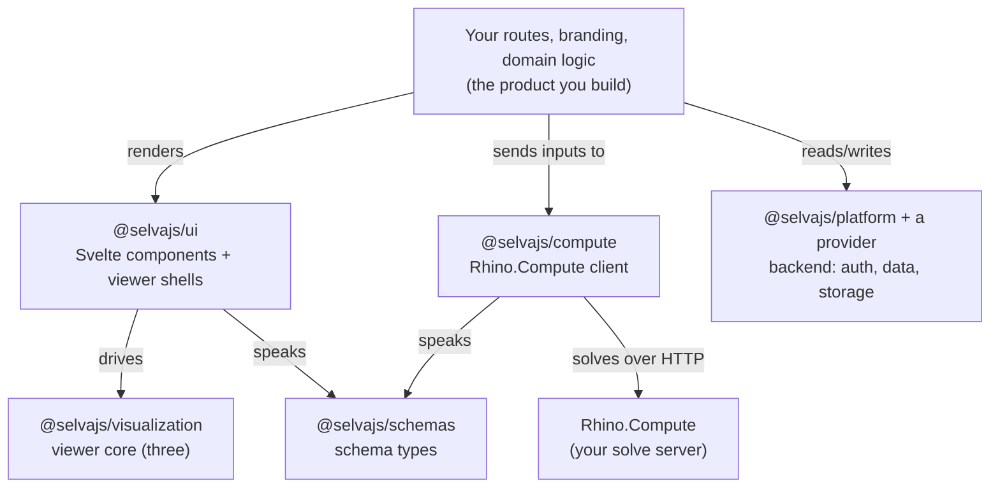

# Build your own app

Everything the standalone `@selvajs/selva` app does also ships as npm packages, so you can drop the viewer, the controls, and the solve pipeline into a product of your own. Take this path when you want your own branding, routes, and domain model, with Selva doing the parametric work underneath.

## The model

Build a normal SvelteKit app, add the `@selvajs/*` packages, and wrap them in whatever you're building.



Read it top-down. **Your app** is the product. It pulls in the Svelte layer (`ui`), the compute client, and a backend (`platform` + a provider) as building blocks. `ui` and `compute` both speak the same schema contract (`schemas`), `visualization` turns solve responses into Three.js objects, and `compute` is the only piece that talks to your Rhino.Compute server. Take only the boxes you need.

## Building blocks

| Package                          | Gives you                                                                                                      |
| -------------------------------- | -------------------------------------------------------------------------------------------------------------- |
| `@selvajs/ui`                    | Svelte components, theme, and the viewer/solve-session shells the Selva app is built from. Style to your brand. |
| `@selvajs/visualization`         | The framework-free viewer core: solve response → Three.js. `three` is a peer dep.                               |
| `@selvajs/compute`               | Type-safe Rhino.Compute client. Turns inputs into solved geometry. No renderer. See below.                     |
| `@selvajs/schemas`               | Schema types and traversal helpers, so your app speaks the same contract as the plugin.                        |
| `@selvajs/platform` + a provider | The backend contract, plus an implementation of it. See [Providers](../../self-hosting/providers/overview.md). |

Mix and match. If you only want the viewer and solving inside an otherwise custom app, `@selvajs/ui` and `@selvajs/compute` are enough: `ui` peer-depends on `visualization`, `solve`, `schemas`, and `three`, so install those alongside it.

These are the ones you'll reach for first, not the whole set. The
[packages page](https://selva.dev/packages) lists every `@selvajs/*` package with
a link to its README and npm entry. Each README is the reference for its own API.

## Getting started

These are ordinary npm packages. Install what you need, then point the compute client at your Rhino.Compute server ([step 1](../../self-hosting/get-started/overview.md)).

```bash
pnpm add @selvajs/ui @selvajs/visualization @selvajs/solve @selvajs/compute @selvajs/schemas three
# + @selvajs/platform and a provider for Selva's backend model
```

Each package README covers its own imports and setup. [`@selvajs/ui`](https://www.npmjs.com/package/@selvajs/ui) is the best place to start; for solving, read on.

## The compute client

[`@selvajs/compute`](https://www.npmjs.com/package/@selvajs/compute) talks to Rhino.Compute and nothing else; it has no renderer and no `three` dependency. It gives you:

- Calls to Compute that return geometry, with errors you can narrow on instead of guess at.
- Reading and writing Grasshopper **data trees**.
- The same API in the browser and in Node.

Import from `/grasshopper` or `/core`, whichever you need, so a bundler drops the rest. The root export is empty on purpose, so importing from the bare package name gets you nothing.

Turning a solve response into Three.js objects is a separate job, and [`@selvajs/visualization`](https://www.npmjs.com/package/@selvajs/visualization) does it. Import from `/scene`, `/render`, or `/parse`.

**Full API reference: <https://selva.dev/docs/api/compute/>**

## Next

- [Architecture](../../architecture.md): how these relate to the plugin and Compute.
- [Providers](../../self-hosting/providers/overview.md): wiring in a backend.
