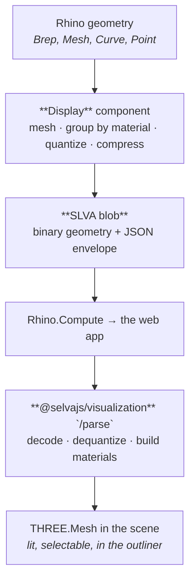

# The display pipeline

What happens between a Brep on the Grasshopper canvas and a lit, selectable mesh in the browser. Most of the time you never need to know this — drop a **Display** component and it works. Read this when you are debugging a scene that looks wrong, tuning a slow one, or extending the viewer.

## The short version



Five stages. The first two happen in Grasshopper, the last two in the browser.

## Stage 1 — Meshing (Grasshopper)

The **Display** component takes geometry as a tree and converts anything that isn't already a mesh into one, using the meshing settings on its `MS` input (default: `FastRenderMesh`).

Alongside the geometry it reads four parallel trees:

| Input          | Purpose                                                                |
| -------------- | ---------------------------------------------------------------------- |
| `Name` (N)     | The object's name in the scene outliner.                               |
| `Layer` (L)    | Grouping path, e.g. `Structure/Walls`. Builds the outliner tree.       |
| `Metadata` (D) | `Key=Value` strings surfaced when the user selects the object.         |
| `Material` (M) | A **Three Material**. Objects sharing a material get batched together. |

**One batch per input branch.** The output tree mirrors the input tree rather than flattening — so branch structure you built upstream survives into the viewer.

Two things worth knowing here:

- **Meshing is the expensive part.** It runs on a background task, not the solver thread, so Grasshopper stays responsive. But on a slow definition it still dominates. If your geometry doesn't change between solves, mesh once and cache it with **Display To File** / **Display From File**.
- **Non-mesh geometry rides along as JSON.** Curves and points are not meshed; they travel as _display items_ alongside the binary blob, and are tessellated in the browser.

## Stage 2 — Encoding (Grasshopper)

The meshes are then packed into a compact binary format, in four steps:

1. **Group by material.** Every unique material becomes one group; all meshes using it are concatenated into one vertex/index stream. Fewer groups means fewer draw calls in the browser.
2. **Quantize.** Vertex positions are snapped to a 16-bit grid spanning the geometry's bounding box — a 2× size reduction over float32, and lossless enough that the error stays far below anything visible. If the resulting step would exceed ~5 cm per unit (a very large model), it falls back to raw float32 rather than degrade the preview. UVs quantize to 16 bits the same way; vertex colours are 8-bit per channel.
3. **Delta filter.** Each vertex component is stored as the difference from the previous vertex, zigzag-mapped so small differences become small unsigned numbers. Welded meshes have spatially-local vertices, so the deltas cluster near zero — this is a PNG-style pre-filter and it exists purely to make the next step work better.
4. **Deflate.** The filtered stream is compressed.

The result is a **SLVA** blob: a magic header, a version, a JSON metadata envelope (materials, groups, source component id), then the geometry block. Curves and points ride as JSON next to it.

The blob is self-describing and transport-agnostic — the browser decoder never branches on how it arrived.

> The wire format is an internal detail of the plugin and `@selvajs/visualization`. It is versioned and can change without a major bump; don't build against it directly. The authoritative spec is the comment block at the top of `BinaryGeometryWriter.cs`.

## Stage 3 — Transport

The blob travels base64-encoded inside the solve response from Rhino.Compute. Large file outputs stream out-of-band instead ([ADR 0003](../adr/0003-large-file-output-streaming.md)); display payloads currently do not.

This is the stage to look at when a scene is slow to _appear_ but fast to _interact with_. Check the payload size with the **Display Size** component. If it's large, the usual causes are meshing too finely, or emitting geometry the user can't see.

## Stage 4 — Parsing (browser)

Handled by `@selvajs/visualization` in its `/parse` layer. It reverses the encode:

```
solve response
  └─ webdisplay-parser      pick out display data, scale to metres, ground, bound
       └─ batch-parser      entry point; can run off-thread in a worker
            ├─ binary-parser     SLVA decode: header, inflate, un-delta, dequantize
            ├─ batch/metadata    validate group windows
            ├─ batch/materials   SerializableMaterial → MeshPhysicalMaterial
            └─ batch/merge       build merged + individual meshes
```

Curves and points go down a separate path: decoded with `rhino3dm`, adaptively tessellated, and built into fat lines and point clouds.

Two behaviours to know:

- **Parsing can run in a worker.** Decoding a large blob on the main thread would block the UI, so the batch parser has an off-thread path.
- **Absent data is not an error, corrupt data is.** An envelope with no display data yields an empty scene. A _truncated_ blob or an out-of-range group window throws — better a visible failure than a silently half-rendered model.

## Stage 5 — The scene

The parsed meshes are added to the Three.js scene by the viewer (`/render`), and the scene outliner (`/scene`) reads visibility, selection, and the layer tree off them. The `Layer` strings from stage 1 are what build that tree; the `Metadata` pairs are what the selection panel shows.

Three invariants hold across the whole pipeline:

- **One coordinate frame end to end.** The Three scene _is_ Rhino's Z-up frame. Vertices pass through unrotated — nothing anywhere reintroduces a rotation.
- **Nothing caches across solves.** Every solve decodes its own geometry and textures. The scene owns what it built and frees it when replaced.
- **The scene owns its GPU resources.** Geometries and textures are disposed with the objects holding them.

## Debugging a bad scene

| Symptom                                    | Look at                                                                                    |
| ------------------------------------------ | ------------------------------------------------------------------------------------------ |
| Nothing renders                            | Is the Display output actually reaching the schema? Check the UI Bridge picked it up.      |
| Geometry is there but untextured/grey      | Material wired? A texture that failed to load leaves the base colour.                      |
| Faceted where it should be smooth          | Meshing settings on Display's `MS` input.                                                  |
| Slow to load                               | **Display Size**. Then meshing density, then how much geometry you're emitting at all.     |
| Slow to orbit once loaded                  | Too many distinct materials — every unique material is its own draw call. Share materials. |
| Scene looks right, outliner is a flat list | The `Layer` input is empty. It's what builds the tree.                                     |
| Curves missing, meshes fine                | The host didn't supply a `rhino3dm` instance; curves are skipped with a warning.           |

## Next

- [Display](../plugin/display.md): the components themselves.
- [Plugin overview](../plugin/overview.md)
- [Caching](../Caching.md): what is and isn't reused between solves.
