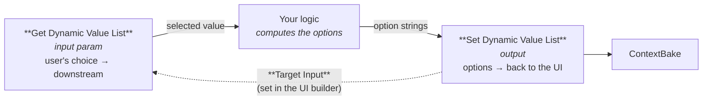

# Dynamic value lists

A normal dropdown has fixed options: you write them into a Grasshopper value list and they never change. A **dynamic** value list computes its options during the solve — from a file the user uploaded, from a database, from whatever the definition just worked out.

This is the one part of Selva that loops back on itself instead of running in a straight line, which is why it gets its own page. The part that catches people out: it takes **two components plus a link you set in the UI builder**, and nothing on the canvas shows you that link.

## Which one do you need?

| Use                                                   | Component                                               |
| ----------------------------------------------------- | ------------------------------------------------------- |
| Options are known when you author the definition      | **Get Value List** + a normal Grasshopper value list    |
| Options depend on something computed during the solve | **Get Dynamic Value List** + **Set Dynamic Value List** |

If a plain value list will do, use it. Reach for the dynamic pair only when the options genuinely can't be written down in advance.

## The shape of it

Three pieces. The link between the first and third is the one you can't see on the canvas:



Read it as: **Set** publishes the options, **Get** receives the user's choice. The dotted line is the piece you configure in the schema designer, not on the canvas.

It loops because the options themselves usually depend on other inputs. The user uploads a file, the definition reads the layer names out of it, those become the dropdown options, the user picks one, and the next solve uses that pick. The round-trip is exactly one solve long.

## Wiring it up

### 1. Drop a **Get Dynamic Value List**

_Params → Util._ Wire its output into whatever consumes the selection, and leave the input unwired for now.

This param is what the user sees as a dropdown. On its own it has no options, and emits an empty string until something populates it.

### 2. Compute the options and feed **Set Dynamic Value List**

_Selva → Utilities._ Its `Options` input takes a list of strings, one per option, in this format:

```
"Ground floor" = 0
"First floor" = 1
"Roof" = 2
```

The quoted part is what the user sees; the part after `=` is what flows out of the Get param when that option is picked. Build these strings however you like — concatenate them from your own data.

> **Option names must be unique.** A duplicate is an error, not a silent overwrite, because names are the list's keys and a shadowed entry would be invisible to debug.

### 3. Wire **Set** into a ContextBake

Same gesture as every other non-geometry output. That is what makes the UI Bridge notice it and put it in the schema.

### 4. Link them in the UI builder

Open the schema designer. Find the Dynamic Value List **output** in your layout, open its **Advanced** settings, and set **Target Input** to the Get param you dropped in step 1.

This is the step people miss. Until you set it, the Set component runs, computes its options perfectly, and sends them nowhere. It tells you so, with a remark on the canvas:

> No target Get Dynamic Value List input set. Set the Target Input under this output's Advanced settings in the Selva UI builder.

If the picker says _"No Dynamic Value List inputs in this schema"_, you haven't added the Get param to the layout yet. Add it, then come back.

## Seeding initial options

A Get param with no options yet shows as an empty dropdown, which is an awkward first impression. To avoid it, wire a source of `"name" = value` pair strings — a panel, or anything else producing those strings — straight into the Get param on the canvas. Those become the starting options, and the first one is the default until the user picks something.

Computed options always win once they arrive. Treat the wired source as the fallback that keeps the definition sensible when you open it in Rhino.

## Multi-select

Set the widget's display to **checklist** in the schema designer and the param switches to list access, emitting every selected value instead of one.

## Behaviour worth knowing

- **The selection survives a save.** The chosen value is written into the `.gh` and re-resolved against the current options on the next solve, so reopening the file doesn't reset the dropdown.
- **Unknown values pass through.** Unlike the static value list, there is no authoritative option set to validate against, because the options are recomputed every solve. A selection that matches no current option flows downstream verbatim rather than being dropped.
- **Options are matched by name.** The user picks `"Ground floor"`, the definition receives `0`.

## Troubleshooting

| Symptom                                             | Cause                                                                                                    |
| --------------------------------------------------- | -------------------------------------------------------------------------------------------------------- |
| Dropdown is empty in the web app                    | **Target Input** isn't set. Check for the remark on the Set component.                                   |
| Dropdown is empty on the canvas but fine in the app | Normal — nothing has computed options yet. Wire initial options if it bothers you.                       |
| "Duplicate option name(s)" error                    | Two options share a name. Names are keys; make them unique.                                              |
| Target Input picker is empty                        | The Get param isn't in the schema layout yet. Add it first.                                              |
| Options update one solve late                       | Expected. The loop is one solve long: compute → publish → user picks → next solve.                       |
| Selection resets when reopening the definition      | Shouldn't happen; the selection is persisted. Check the Set component is still wired to its ContextBake. |

## Next

- [Inputs](../plugin/compute-io.md): the other input parameters.
- [UI Builder](../plugin/ui-builder.md): the schema designer.
- [Plugin overview](../plugin/overview.md)
