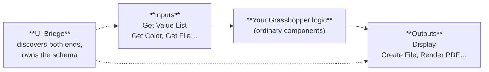

# The Selva plugin

`Selva.gha` is the Grasshopper side of Selva. It is where an author turns a definition into a web interface, and it is what Rhino.Compute loads to solve that definition once the app is deployed. A single self-contained `.gha` — all web assets are embedded, nothing else to install.

## The mental model

A Selva definition has three kinds of thing in it, and nearly every component belongs to exactly one:

- **Inputs** are the `Get …` parameters. They are _contextual_ params: left unwired on the canvas, they take their value from the web UI at solve time and pass it downstream. You can wire a source into them so the definition still solves sensibly inside Rhino.
- **Outputs** are what the web app shows or offers for download: a 3D scene, a file, a rendered drawing.
- **UI Bridge** sits to one side of the graph. It discovers the inputs and outputs, hosts the schema designer, and stores the resulting layout — the **schema** — inside the `.gh` file.

Everything between input and output is ordinary Grasshopper. Selva does not care what happens there.

### One authoring gesture for outputs: ContextBake

Outputs that are not the 3D scene — files, rendered drawings, dynamic value lists — are all exposed the same way: wire the component's output into a **ContextBake** component (the stock Hops one). After each solve the UI Bridge scans for those and merges them into the schema. Unwire one and it drops out of the schema on the next solve.

**Display** is the exception: the UI Bridge picks it up directly, no ContextBake needed.

## Where things live on the ribbon

| Ribbon location   | What's there                                                             |
| ----------------- | ------------------------------------------------------------------------ |
| Selva → UI        | UI Bridge, Evaluate Schema                                               |
| Selva → Display   | Display, Three Material, Display To/From File, Display Size              |
| Selva → IO        | Create File, Geometry To File, Block To File, File From Path, Bake Files |
| Selva → Drawing   | The 2D drawing document model (~23 components)                           |
| Selva → Layout    | Legend Block, Notes Block, Revision Table                                |
| Selva → Elements  | The drawing style params (Stroke, Fill, Path Style, Text Style)          |
| Selva → Utilities | Environment, Set Dynamic Value List                                      |
| **Params → Util** | The `Get …` input parameters                                             |

The `Get …` inputs sit under **Params**, not the Selva tab, because they are Grasshopper _parameters_ rather than components. They draw with a purple corner overlay to mark them as contextual.

## Every component

### UI — the bridge

| Component           | Does                                                                                                                                                                                                                         |
| ------------------- | ---------------------------------------------------------------------------------------------------------------------------------------------------------------------------------------------------------------------------- |
| **UI Bridge**       | The one component every Selva definition needs. Discovers inputs and outputs, runs the WebSocket bridge to the schema designer (port 8765), stores the schema in the `.gh`. Outputs the current schema and the designer URL. |
| **Evaluate Schema** | Debug aid. Given a schema, prints a readable summary, the raw JSON, and the input/output counts.                                                                                                                             |

Details: [UI Builder](../plugin/ui-builder.md).

### Inputs — what the user drives

Contextual params, all under **Params → Util**. Drop one, wire its output into your logic, and it becomes a control in the web UI.

| Parameter                  | Web control           | Notes                                                                                                                                                                                                           |
| -------------------------- | --------------------- | --------------------------------------------------------------------------------------------------------------------------------------------------------------------------------------------------------------- |
| **Get Value List**         | Dropdown / checklist  | Options come from a Grasshopper value list wired into it — that value list stays the source of truth.                                                                                                           |
| **Get Dynamic Value List** | Dropdown / checklist  | Options are computed by the definition at solve time rather than fixed up front. See [Dynamic value lists](../plugin/dynamic-value-lists.md).                                                                   |
| **Get Color**              | Colour picker         | Travels as a hex string, arrives as a Grasshopper colour.                                                                                                                                                       |
| **Get File**               | File upload           | Imports geometry from an upload, a URL, or a path. Accepted formats are schema-driven.                                                                                                                          |
| **Get Image**              | Image upload          | PNG/JPEG/WEBP/SVG. Performs no Rhino import — it carries the raw image downstream, typically into Drawing's Draw Image.                                                                                         |
| **Get Server File**        | _(none — author-set)_ | Reads a file from the compute server's data directory by _relative_ path, so one definition works on any server. Right-click → _Pick local file…_ to test locally; that override is never saved into the `.gh`. |

Plus one ordinary component:

| Component       | Does                                                                                                                                        |
| --------------- | ------------------------------------------------------------------------------------------------------------------------------------------- |
| **Environment** | Reports whether the definition is running on Rhino.Compute or on a desktop Rhino. Use it to skip expensive preview-only work on the server. |

Details: [Inputs](../plugin/compute-io.md).

### Display — the 3D viewer

| Component             | Does                                                                                                                                                                                                                                        |
| --------------------- | ------------------------------------------------------------------------------------------------------------------------------------------------------------------------------------------------------------------------------------------- |
| **Display**           | The one that matters. Takes geometry plus optional name, layer, metadata, material, and meshing settings, and produces the payload the browser viewer renders. Emits one batch per input branch, so the output tree mirrors the input tree. |
| **Three Material**    | Builds a material — colour, metalness, roughness, opacity, transparency, texture — for Display's Material input.                                                                                                                            |
| **Display To File**   | Writes a Display payload to a `.dmf` on disk.                                                                                                                                                                                               |
| **Display From File** | Reads one back. The pair lets you mesh once and reuse it instead of re-meshing every solve.                                                                                                                                                 |
| **Display Size**      | Reports the byte size of a Display payload. Reach for it when a scene feels slow.                                                                                                                                                           |

Details: [Display](../plugin/display.md), and [the display pipeline](../plugin/display-pipeline.md) for what happens to that payload afterwards.

### IO — downloadable files

| Component            | Does                                                                                       |
| -------------------- | ------------------------------------------------------------------------------------------ |
| **Create File**      | Turns text or base64 data into a file — CSV, JSON, whatever.                               |
| **Geometry To File** | Exports geometry with layer names and colours to one or more files.                        |
| **Block To File**    | Exports Rhino block instances to `.3dm` or `.stp`.                                         |
| **File From Path**   | Wraps a file already on disk as a Selva file output.                                       |
| **Bake Files**       | Author-side only: writes file outputs to a folder so you can check them without deploying. |

The first four each produce a _File_ output — wire it into a ContextBake to turn it into a download in the web app. All four take an optional sub-folder and `Key=Value` metadata.

Details: [File I/O](../plugin/file-io.md).

### Drawing — 2D sheets

A document-model drawing library: pages, frames, grids, views, dimensions, tables, title blocks, styles, rendered to SVG or PDF. The largest feature area, with its own page.

Details: [Drawing](../plugin/drawing.md).

## The smallest real definition

1. A **Get Value List** — or a plain slider; ordinary Grasshopper params work as inputs too — feeding your logic.
2. Your logic, producing geometry.
3. A **Display** component on that geometry.
4. A **UI Bridge**, enabled.

Open the designer at the UI Bridge's URL, drag the input onto a control, save. The schema is now inside the `.gh` and the definition is deployable.

## Install

1. Install **Selva** from the Grasshopper Package Manager, or drop the `.gha` from [Food4Rhino](https://www.food4rhino.com/en/app/selva) into your Libraries folder.
2. Restart Rhino.
3. Install the same `.gha` on your Rhino.Compute server, or the deployed app cannot solve.

Install paths per OS are in the repo README.

## Selva Canopy

[Selva Canopy](https://www.food4rhino.com/en/app/selva-canopy) is a companion plugin that adds plotting components. Install it from Food4Rhino alongside the main plugin.

## Next

- [UI Builder](../plugin/ui-builder.md): the bridge and the schema.
- [The display pipeline](../plugin/display-pipeline.md): geometry from Grasshopper to Three.js.
- [Dynamic value lists](../plugin/dynamic-value-lists.md): options the definition computes.
- [Architecture](../architecture.md): design-time vs run-time paths.
