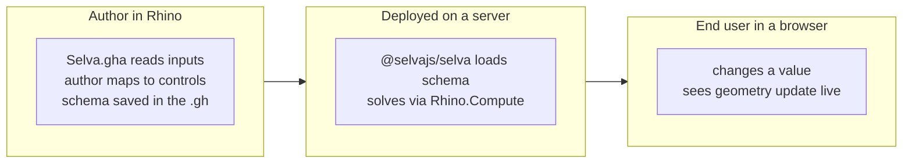

# What is Selva

Selva turns a **Grasshopper definition** into a **web app**. No Rhino, no Grasshopper knowledge, no install for your users.

A designer builds parametric logic once in Grasshopper. Selva exposes its inputs as web controls, solves the definition on a server, and renders the geometry in a browser 3D viewer. Anyone with a link can drive the model.

## The problem

Grasshopper logic stays trapped inside Rhino on the author's machine. Sharing it means handing over a `.gh` file, expecting the other person to own a Rhino license, and expecting them to know Grasshopper well enough to open it without breaking anything. Selva takes that wall down: the definition becomes a URL with a clean UI and a live 3D view.

## Two halves

- **The plugin** (`Selva.gha`) is where you _design the interface_. It reads your definition's parameters, lets you drag them onto web controls, and saves that layout — the **schema** — into the `.gh` file itself. (A `.gha` is just a Grasshopper plugin, like any other component you install.)
- **The web app** (`@selvajs/selva`) is where that interface _runs_. It loads the schema, draws the controls, and solves the definition through **Rhino.Compute**: a copy of Rhino on a server with no window and no mouse, doing nothing but solving definitions on request. Your users never touch Rhino.

> **New to the web side?** A few terms show up throughout these docs — _schema_, _Rhino.Compute_, _provider_, _the CLI_. Each is explained where it first matters, and the [Architecture](architecture.md) page lays them all out together. You don't need web-dev experience to follow along.

One schema drives both, generated into TypeScript (UI) and C# (plugin) so they never drift.

## The flow

## What you get

- **Schema designer.** Map parameters to controls visually, no front-end code.
- **Live 3D viewer.** Grasshopper geometry in the browser via Three.js.
- **Cloud solving.** Runs on Rhino.Compute; users need no Rhino.
- **Type-safe end to end.** One schema, both stacks generated from it.
- **Bring your own backend.** Auth, data, storage are pluggable [providers](providers.md).

## Two ways to use it

1. **Deploy the standalone app** with `@selvajs/selva` + the [CLI](CLI.md) (a command-line tool that sets up and runs your deployment for you). A multi-user platform for hosting and sharing definitions. Most teams take this path.
2. **Build your own app.** Selva's viewer, controls, and compute client ship as reusable `@selvajs/*` code packages you can drop into your own product. See [Build your own app](getting-started/build-your-own-app.md).

## Next

- [Architecture](architecture.md): how the parts fit together.
- [Providers](providers.md): the bring-your-own-backend model.
- [Get Started](getting-started/overview.md): set it up.
