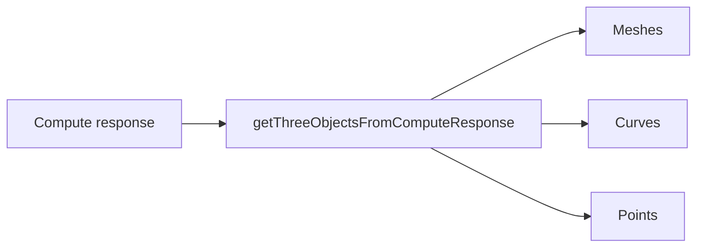

# `parse/` — payload → THREE objects

Turns what the backend sent into meshes, curves and points you can add to a scene. It never touches
the scene, the camera, or the DOM: that's `render/`.

## The one call you probably want

```ts
import { getThreeObjectsFromComputeResponse } from '@selvajs/visualization/parse';

const objects = await getThreeObjectsFromComputeResponse(response);
```

`response` is the Rhino.Compute response for your definition. Out comes a flat `THREE.Object3D[]`:
meshes, curves and points mixed together, materials and colours already applied. Hand it straight to
`updateScene`.



## If you don't have a compute response

Three smaller entry points, for hosts that get their geometry another way.

| You have                            | Call                                | You get            |
| ----------------------------------- | ----------------------------------- | ------------------ |
| A raw binary mesh blob (`SLVA`)     | `await parseMeshBatchBlob(blob)`    | `THREE.Mesh[]`     |
| A `DisplayBatch` object             | `await parseMeshBatchObject(batch)` | `THREE.Mesh[]`     |
| Just display items (curves, points) | `parseDisplayItems(items)`          | `THREE.Object3D[]` |

```ts
// A saved .slvm file, or a blob straight off a WebSocket:
const meshes = await parseMeshBatchBlob(blob, { mergeByMaterial: false });
```

`mergeByMaterial` defaults to `true` (fewer draw calls). Turn it off when each source object needs to
stay its own mesh, for example so the outliner can hide them one at a time.

## Units

Geometry is scaled from the Rhino model units named in the response. `SCALE_FACTORS` maps a unit name
to metres if you need to do that conversion yourself:

```ts
import { SCALE_FACTORS } from '@selvajs/visualization/parse';

SCALE_FACTORS.Millimeters; // 0.001
```

An unrecognised unit logs a warning once and leaves geometry unscaled.

## What to expect

- Malformed data throws. A parse failure is a bug in the payload, not something to paper over.
- Missing display items are fine: you just get fewer objects back.
- The parser never rotates geometry. The viewer owns orientation.

## Adding a new display item type

Three edits, all in `display-items/`: a type in `types.ts`, a builder in `items/`, a case in
`display-items-parser.ts`.

## Not exported, on purpose

The SLVA binary wire format (magics, version gates, flag bits) is private to `parseMeshBatch*` so
it can change without a major version bump. Format spec:
[docs/contributing/slva-format.md](../../../../docs/contributing/slva-format.md).
