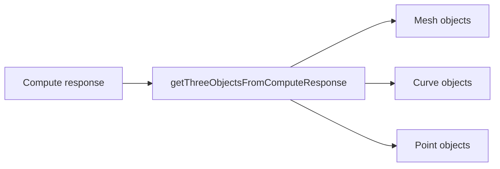

# `parse/` — how payloads become objects

This folder turns a backend response into objects you can put in a Three.js scene.
It depends only on `shared/` and does not import `render/` or `scene/`.

## What it handles

| Kind                         | Entry point                          | What comes out             |
| ---------------------------- | ------------------------------------ | -------------------------- |
| Mesh batches + display items | `getThreeObjectsFromComputeResponse` | meshes, curves, and points |
| Display items only           | `parseDisplayItems`                  | curves and points          |

## Simple flow



The parser reads the response, pulls out the mesh batches, and then reads any display items that are
already inside the same payload.

## Common use

Use the full-response helper when you already have a compute result:

```ts
const objects = await getThreeObjectsFromComputeResponse(response);
updateScene(scene, objects, camera, controls, false);
```

Use the smaller helper when you already have just the display items:

```ts
const objects = parseDisplayItems(batch.items);
```

Use a custom unit scale when you need a specific conversion:

```ts
const scale = SCALE_FACTORS.Millimeters;
```

## If you do not use Compute

Not every host has a full `GrasshopperComputeResponse`. If you already have the mesh batch JSON
from another source, use the smaller helpers directly:

```ts
const batchJson = JSON.parse(textFromWire);
const batch = parseMeshBatchObject(batchJson);
const objects = parseDisplayItems(batch.items);
```

If the data is still a binary `SLVA` blob, decode that first with `parseMeshBatchBlob` and then
pass the result to `parseMeshBatchObject`.

## What happens inside

- Mesh batches are decoded from the binary `SLVA` payload.
- Curves are drawn from tessellated points sent by the backend.
- Points are turned into `THREE.Points`.
- Materials and colors are applied while parsing.

## A few rules

- A broken response should fail loudly when the data is malformed.
- Missing display items are fine; the parser just returns fewer objects.
- The parser does not rotate geometry. The viewer owns orientation.

## Adding more

- Add a new display item type in `display-items/types.ts`.
- Add a builder in `display-items/items/`.
- Add a case in `display-items-parser.ts`.

## Why this folder stays small

`parse/` only turns payloads into objects. It does not own the scene, the camera, or the UI.
